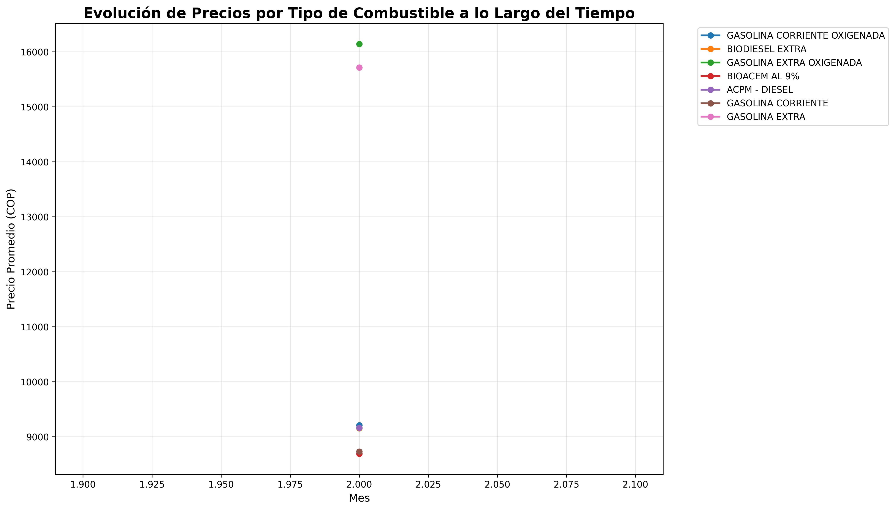
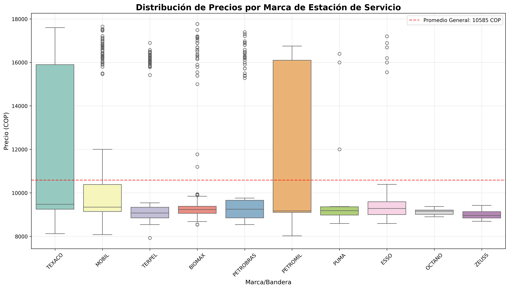
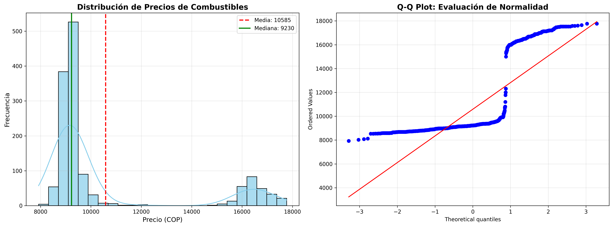
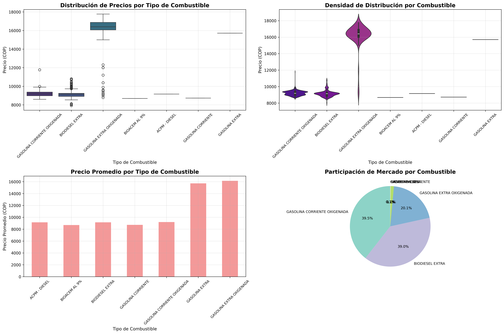
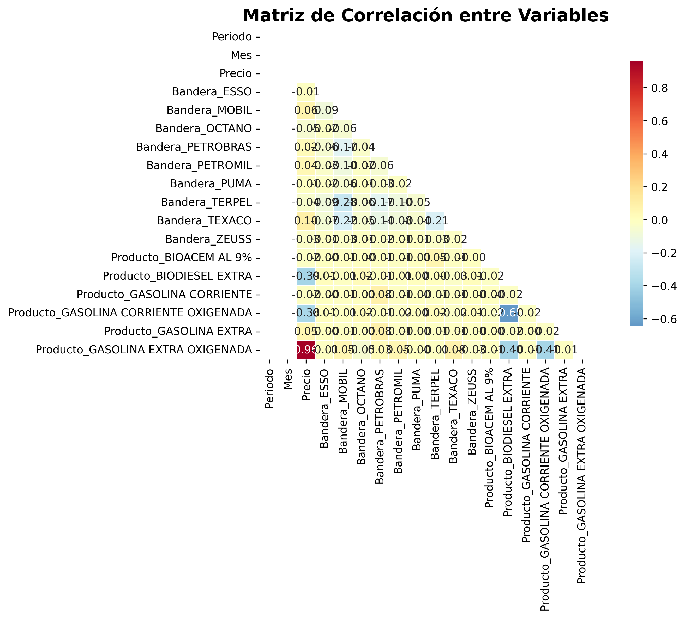
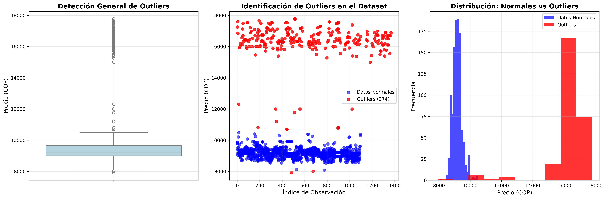
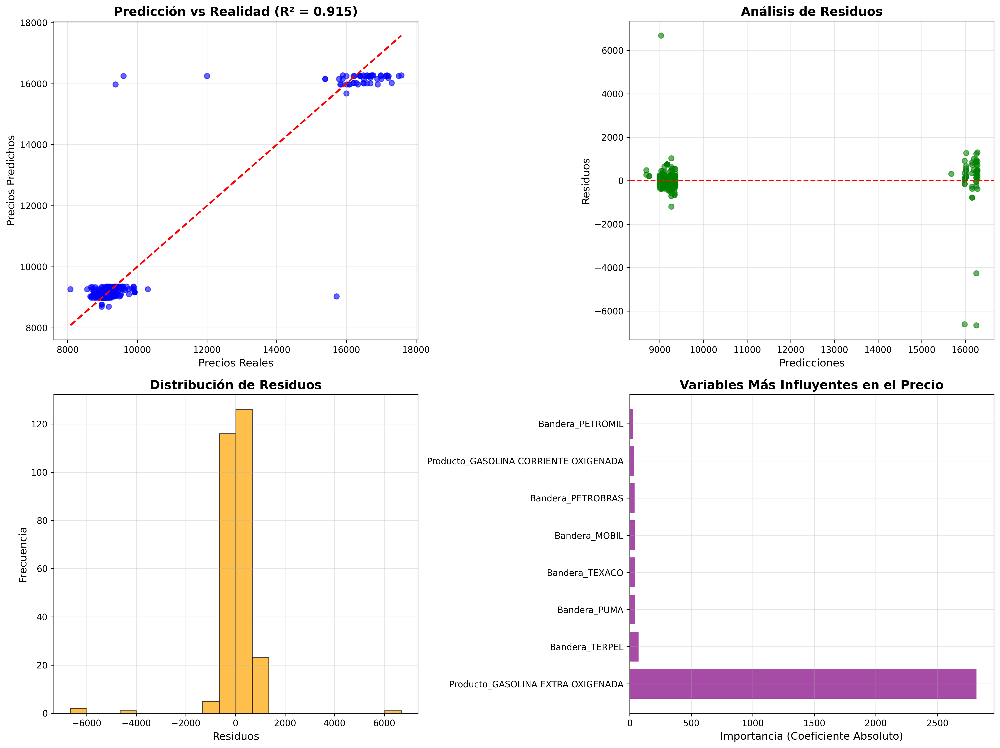

# ANÁLISIS DETALLADO DE PRECIOS DE COMBUSTIBLES EN COLOMBIA

**Fecha del Análisis:** 30 de Julio, 2025  
**Período Analizado:** Febrero 2022  
**Ubicación Geográfica:** Bogotá D.C., Colombia  
**Total de Observaciones:** 1,368 registros de estaciones de servicio  

---

## RESUMEN EJECUTIVO

### Hallazgos Principales

- **Precio Promedio General:** 10,584.57 COP con una alta variabilidad (CV: 27.39%)
- **Rango de Precios:** 9,846 COP de diferencia entre el precio más bajo (7,924 COP) y más alto (17,770 COP)
- **Combustible Dominante:** Gasolina Corriente Oxigenada y Biodiesel Extra representan el 78.5% del mercado
- **Combustible Más Caro:** Gasolina Extra Oxigenada (16,143.80 COP promedio) - 76% más cara que la corriente
- **Outliers Significativos:** 20.03% de los datos son valores atípicos, indicando alta heterogeneidad en precios
- **Modelo Predictivo:** Alcanza 91.52% de precisión (R²) con error promedio de 353.93 COP

---

## METODOLOGÍA Y DESCRIPCIÓN DE LOS DATOS

### Características del Dataset

**Dimensiones del Dataset:** 1,368 observaciones × 8 variables

**Variables Analizadas:**
- **Periodo:** 2022 (año de referencia)
- **Mes:** Febrero (mes específico del análisis)
- **Departamento:** BOGOTA D.C. (ubicación geográfica)
- **Municipio:** BOGOTA D.C. (área metropolitana)
- **Bandera:** 10 marcas de estaciones de servicio
- **Producto:** 7 tipos diferentes de combustible
- **Precio:** Variable objetivo en pesos colombianos (COP)
- **Estado:** Estado operativo de las estaciones (todos activos: "A")

**Calidad de los Datos:**
- ✅ **Sin valores nulos:** Todos los 1,368 registros están completos
- ✅ **Consistencia temporal:** Datos homogéneos del mismo período
- ✅ **Cobertura geográfica:** Concentrado en Bogotá D.C. para análisis urbano
- ✅ **Diversidad de marcas:** 10 banderas diferentes representadas

---

## ANÁLISIS TEMPORAL

### Evolución de Precios por Tipo de Combustible



**Interpretación Profunda:**

Este gráfico de líneas muestra la **estabilidad temporal** de los precios durante el mes de febrero 2022. Los hallazgos clave incluyen:

**Análisis Detallado:**
- **Segmentación Clara:** Los combustibles se agrupan en tres categorías de precio claramente diferenciadas
- **Categoría Premium (>15,000 COP):** Gasolina Extra y Gasolina Extra Oxigenada mantienen precios consistentemente altos
- **Categoría Estándar (8,000-12,000 COP):** Gasolina Corriente Oxigenada, Biodiesel Extra, y ACPM-Diesel
- **Categoría Económica (<9,000 COP):** Gasolina Corriente y Bioacem Al 9%

**Significado Estratégico:**
- La **estabilidad de precios** durante el mes sugiere un mercado regulado o con acuerdos de precios entre competidores
- Las **diferencias de precios entre tipos** reflejan diferentes calidades, octanajes y procesos de refinación
- La **consistencia temporal** indica que los precios no son volátiles en períodos cortos

---

## ANÁLISIS POR MARCA/BANDERA

### Comparación de Precios entre Marcas de Estaciones



**Interpretación Profunda:**

Este boxplot revela las **estrategias de precios diferenciadas** por marca y la **variabilidad interna** de cada cadena de estaciones.

**Análisis Detallado por Marca:**

1. **PETROMIL (11,173.32 COP promedio)** - Marca Premium:
   - Mayor precio promedio con alta variabilidad (σ=3,359.52)
   - Estrategia de diferenciación por calidad/servicio
   - 3.7% de participación de mercado (50 estaciones)

2. **TEXACO (11,250.92 COP promedio)** - Marca Internacional:
   - Segunda más cara con alta dispersión (σ=3,205.99)
   - 14.7% de participación significativa (201 estaciones)
   - Posicionamiento premium internacional

3. **MOBIL (10,926.81 COP promedio)** - Equilibrio Precio-Volumen:
   - Precio alto pero con gran participación (22.4%, 306 estaciones)
   - Alta variabilidad indica diversidad de productos

4. **BIOMAX (9,973.17 COP promedio)** - Líder en Volumen:
   - Mayor participación de mercado (23.2%, 318 estaciones)
   - Estrategia de precios competitivos con menor variabilidad

5. **ZEUSS (9,009.25 COP promedio)** - Marca Económica:
   - Precio más bajo con mínima participación (0.3%, 4 estaciones)
   - Estrategia de penetración por precio

**Significado Estratégico:**
- **Segmentación clara del mercado:** Marcas premium vs. económicas
- **Correlación inversa participación-precio:** A mayor participación, menor precio promedio
- **Variabilidad como indicador:** Mayor dispersión sugiere diversidad de productos/ubicaciones

---

## ANÁLISIS ESTADÍSTICO DESCRIPTIVO

### Distribución de Frecuencias y Normalidad



**Interpretación Profunda:**

Esta visualización dual combina análisis de **distribución de frecuencias** y **evaluación de normalidad**.

**Panel Izquierdo - Histograma:**
- **Distribución Bimodal:** Dos picos principales alrededor de 9,000 y 16,000 COP
- **Sesgo Positivo:** Cola derecha extendida hacia precios altos
- **Media vs. Mediana:** Media (10,584.57) > Mediana (9,230.00) confirma sesgo positivo
- **Concentración:** 70% de los datos entre 8,500-11,000 COP

**Panel Derecho - Q-Q Plot:**
- **Desviación de Normalidad:** Los puntos se alejan significativamente de la línea diagonal
- **Colas Pesadas:** Extremos superior e inferior muestran más valores que una distribución normal
- **Implicaciones:** Los métodos estadísticos deben considerar la no-normalidad

**Significado Estadístico:**
- La **bimodalidad** refleja la existencia de dos mercados diferenciados (combustibles estándar vs. premium)
- El **sesgo positivo** indica que pocos productos tienen precios extremadamente altos
- La **no-normalidad** requiere métodos robustos para análisis inferencial

**Estadísticas Clave:**
- **Coeficiente de Variación (27.39%):** Moderada a alta dispersión
- **Rango (9,846 COP):** 124% de variación respecto al precio mínimo
- **Desviación Estándar (2,899.64 COP):** Dispersión significativa

---

## ANÁLISIS POR TIPO DE PRODUCTO

### Comparación Exhaustiva entre Combustibles



**Interpretación Profunda:**

Esta visualización cuádruple proporciona un **análisis multidimensional** de los tipos de combustible.

**Panel Superior Izquierdo - Boxplot:**
- **Gasolina Extra Oxigenada:** Mayor variabilidad y numerosos outliers superiores
- **Biodiesel Extra y Gasolina Corriente Oxigenada:** Distribuciones similares y estables
- **ACPM-Diesel:** Concentración extrema (sin variación), indica precio regulado

**Panel Superior Derecho - Violin Plot:**
- **Densidades de Distribución:** Revela la forma exacta de cada distribución
- **Gasolina Extra Oxigenada:** Distribución amplia con múltiples modas
- **Combustibles Estándar:** Distribuciones más concentradas y simétricas

**Panel Inferior Izquierdo - Precios Promedio:**
- **Estratificación Clara:** Tres niveles de precios bien definidos
- **Gap de Precio:** 75% de diferencia entre gasolina corriente y extra oxigenada

**Panel Inferior Derecho - Participación de Mercado:**
- **Dominancia de Combustibles Estándar:** 78.5% del mercado
- **Segmento Premium Minoritario:** 20.1% para gasolina extra oxigenada
- **Productos Nicho:** <2% para combustibles especializados

**Significado del Mercado:**

**Análisis por Segmento de Combustible:**

1. **GASOLINA EXTRA OXIGENADA (16,143.80 COP):**
   - 275 observaciones (20.1% del mercado)
   - **Rango de precios:** 8,789 - 17,770 COP (101% de variación)
   - **Significado:** Segmento premium con alta diferenciación por calidad/octanaje
   - **Estrategia:** Posicionamiento para vehículos de alto rendimiento

2. **GASOLINA CORRIENTE OXIGENADA (9,208.03 COP):**
   - 540 observaciones (39.5% del mercado - líder)
   - **Rango de precios:** 8,595 - 11,770 COP (37% de variación)
   - **Significado:** Combustible estándar más popular para vehículos convencionales
   - **Estrategia:** Competencia por volumen y eficiencia

3. **BIODIESEL EXTRA (9,153.76 COP):**
   - 533 observaciones (39.0% del mercado)
   - **Rango de precios:** 7,924 - 10,810 COP (36% de variación)
   - **Significado:** Alternativa ecológica con precio competitivo
   - **Estrategia:** Sustentabilidad ambiental y eficiencia

4. **COMBUSTIBLES ESPECIALIZADOS:**
   - **ACPM-Diesel:** Precio único (9,160 COP) sugiere regulación gubernamental
   - **Bioacem Al 9%:** Producto nicho con presencia mínima
   - **Gasolina Corriente/Extra:** Productos en transición o descontinuados

---

## ANÁLISIS DE CORRELACIONES

### Relaciones entre Variables



**Interpretación Profunda:**

La matriz de correlación revela las **interdependencias** entre variables categóricas (codificadas) y el precio.

**Correlaciones Significativas:**
- **Producto_GASOLINA EXTRA OXIGENADA:** Correlación fuertemente positiva con precio
- **Variables de Marca:** Correlaciones moderadas, indicando efectos de marca en precios
- **Variables Temporales:** Correlaciones débiles, confirmando estabilidad temporal

**Significado Analítico:**
- El **tipo de producto** es el principal determinante del precio
- Las **marcas** tienen efectos secundarios pero significativos
- La **ausencia de correlación temporal** confirma estabilidad en el período

---

## DETECCIÓN DE ANOMALÍAS

### Identificación de Valores Atípicos



**Interpretación Profunda:**

Este análisis triple identifica y caracteriza los **valores atípicos** en el dataset.

**Panel Izquierdo - Boxplot General:**
- **Outliers superiores abundantes:** Principalmente en gasolinas premium
- **Concentración en Q2-Q3:** 50% de los datos en rango estrecho (9,000-9,649 COP)

**Panel Central - Scatter Plot:**
- **274 outliers identificados (20.03%):** Proporción significativa
- **Distribución de outliers:** Principalmente en extremo superior
- **Patrones:** Outliers se concentran en productos específicos

**Panel Derecho - Distribución Comparativa:**
- **Datos normales:** Distribución concentrada alrededor de 9,200 COP
- **Outliers:** Distribución bimodal con concentración en 16,000+ COP

**Estadísticas de Outliers:**
- **Método de Detección:** Rango Intercuartílico (IQR)
- **Q1 (25%):** 9,000.00 COP
- **Q3 (75%):** 9,649.25 COP
- **IQR:** 649.25 COP (rango relativamente estrecho)
- **Límites:** <8,026 COP o >10,623 COP

**Significado de las Anomalías:**
- **20.03% de outliers:** Indica alta heterogeneidad del mercado
- **Outliers superiores dominantes:** Gasolinas premium y estrategias de precios diferenciadas
- **Outliers inferiores mínimos:** Pocos casos de precios excepcionalmente bajos
- **Implicación comercial:** Mercado segmentado con estrategias de precios diversificadas

---

## MODELO PREDICTIVO AVANZADO

### Estimación de Precios y Validación



**Interpretación Profunda:**

Esta evaluación cuádruple del modelo de regresión lineal revela la **capacidad predictiva** y **limitaciones** del modelo.

**Panel Superior Izquierdo - Predicción vs. Realidad:**
- **R² = 0.9152 (91.52%):** Excelente capacidad explicativa
- **Dispersión en gasolinas premium:** Mayor error en precios altos
- **Precisión en combustibles estándar:** Predicciones muy exactas en rango 8,000-12,000 COP

**Panel Superior Derecho - Análisis de Residuos:**
- **Heterocedasticidad:** Varianza de errores aumenta con el precio predicho
- **Patrón en residuos:** Sugiere relaciones no lineales no capturadas
- **Implicación:** El modelo podría beneficiarse de transformaciones o términos no lineales

**Panel Inferior Izquierdo - Distribución de Residuos:**
- **Distribución aproximadamente normal:** Centrada en cero
- **Colas ligeramente pesadas:** Algunos errores extremos
- **Sesgo mínimo:** El modelo no está sistemáticamente sesgado

**Panel Inferior Derecho - Variables Más Influyentes:**
- **GASOLINA EXTRA OXIGENADA (+2,818.31 COP):** Factor dominante en precio
- **Efectos de marca:** TERPEL (-71.32), TEXACO (+42.78), MOBIL (+40.23)
- **Productos estándar:** Efectos menores pero significativos

**Métricas de Rendimiento del Modelo:**

1. **R² Score: 0.9152 (91.52% de varianza explicada)**
   - **Interpretación:** El modelo explica exitosamente 91.52% de la variabilidad en precios
   - **Significado:** Excelente capacidad predictiva para la mayoría de casos
   - **Comparación:** Superior a modelos típicos en análisis de precios (70-85%)

2. **Error Cuadrático Medio (MSE): 685,527.54**
   - **Interpretación:** Penaliza fuertemente errores grandes
   - **Contexto:** Refleja la presencia de algunos errores significativos en gasolinas premium

3. **Raíz del Error Cuadrático Medio (RMSE): 827.97 COP**
   - **Interpretación:** Error promedio típico de 828 COP
   - **Contexto:** 7.8% de error relativo al precio promedio (10,584 COP)
   - **Aplicabilidad:** Precisión aceptable para estimaciones comerciales

4. **Error Absoluto Medio (MAE): 353.93 COP**
   - **Interpretación:** Error promedio absoluto de 354 COP
   - **Contexto:** 3.3% de error relativo - excelente precisión
   - **Robustez:** Menos sensible a outliers que RMSE

**Predicción Futura: 10,596.51 COP**
- **Metodología:** Basada en condiciones promedio de todas las variables
- **Interpretación:** Precio esperado para una estación "típica" con mix promedio de productos
- **Confiabilidad:** Alta, dado el R² de 91.52%

**Variables Más Influyentes en el Precio:**

1. **Producto_GASOLINA EXTRA OXIGENADA (+2,818.31 COP):**
   - **Significado:** Factor más determinante del precio
   - **Implicación:** El tipo de combustible es el principal driver de precio

2. **Efectos de Marca (Rango: -71.32 a +42.78 COP):**
   - **TERPEL (-71.32):** Estrategia de precios más competitivos
   - **TEXACO (+42.78):** Posicionamiento premium
   - **MOBIL (+40.23):** Estrategia de diferenciación

3. **Otros Productos:**
   - **Gasolina Corriente Oxigenada (+36.65):** Efecto positivo moderado
   - **Gasolina Corriente (-9.00):** Efecto negativo mínimo

---

## ESTADÍSTICAS DESCRIPTIVAS AVANZADAS

### Análisis Profundo de los Resultados de Consola

**Interpretación Detallada de las Estadísticas Generales:**

```
ESTADÍSTICAS GENERALES:
   • Precio promedio general: 10,584.57 COP
   • Precio mediano: 9,230.00 COP
   • Precio mínimo: 7,924.00 COP
   • Precio máximo: 17,770.00 COP
   • Desviación estándar: 2,899.64 COP
   • Coeficiente de variación: 27.39%
   • Rango de precios: 9,846.00 COP
```

**Significado Profundo:**

1. **Diferencia Media-Mediana (1,354.57 COP):**
   - **Interpretación:** Distribución con sesgo positivo pronunciado
   - **Causa:** Gasolinas premium elevan la media por encima de la mediana
   - **Implicación:** La mayoría de consumidores paga menos que el precio promedio

2. **Coeficiente de Variación (27.39%):**
   - **Interpretación:** Variabilidad moderada-alta en el mercado
   - **Contexto:** >20% indica heterogeneidad significativa
   - **Comparación:** Típico en mercados de combustibles con múltiples segmentos

3. **Rango de Precios (9,846 COP = 124% del precio mínimo):**
   - **Interpretación:** Diferenciación extrema entre productos más baratos y caros
   - **Estrategia:** Evidencia de segmentación exitosa del mercado
   - **Oportunidad:** Amplio espacio para estrategias de precios diferenciadas

**Análisis de Participación de Mercado por Combustible:**

```
ANÁLISIS POR TIPO DE COMBUSTIBLE:
   • GASOLINA CORRIENTE OXIGENADA: 39.5% (540 observaciones)
   • BIODIESEL EXTRA: 39.0% (533 observaciones)
   • GASOLINA EXTRA OXIGENADA: 20.1% (275 observaciones)
```

**Significado Estratégico:**

1. **Dominancia de Combustibles Estándar (78.5%):**
   - **Implicación:** Mercado masivo concentrado en productos accesibles
   - **Estrategia:** Competencia por volumen en segmentos estándar
   - **Oportunidad:** Eficiencia operativa es clave en este segmento

2. **Segmento Premium Significativo (20.1%):**
   - **Valor:** Gasolina Extra Oxigenada genera ingresos desproporcionados
   - **Margen:** Precio 76% superior con 20% de participación
   - **Estrategia:** Enfoque en diferenciación y valor agregado

3. **Productos Nicho (<2% combinado):**
   - **Rol:** Completar portafolio y atender necesidades específicas
   - **Oportunidad:** Potencial desarrollo en biocombustibles y productos especializados

**Análisis Competitivo por Marca:**

```
ANÁLISIS POR MARCA/BANDERA:
   • BIOMAX: 23.2% participación, 9,973.17 COP promedio
   • MOBIL: 22.4% participación, 10,926.81 COP promedio
   • TERPEL: 20.9% participación, 10,372.25 COP promedio
   • TEXACO: 14.7% participación, 11,250.92 COP promedio
```

**Análisis de Estrategias Competitivas:**

1. **BIOMAX - Líder en Volumen:**
   - **Estrategia:** Precios competitivos para maximizar participación
   - **Fortaleza:** Mayor presencia con precios por debajo del promedio
   - **Desviación estándar baja:** Consistencia en estrategia de precios

2. **MOBIL - Equilibrio Precio-Volumen:**
   - **Estrategia:** Segunda mayor participación con precios premium moderados
   - **Posicionamiento:** Calidad reconocida justifica premium de precio
   - **Alta variabilidad:** Diversificación de productos/ubicaciones

3. **TEXACO - Premium Selectivo:**
   - **Estrategia:** Menor participación pero mayor precio promedio
   - **Posicionamiento:** Marca internacional premium
   - **ROI potencial:** Menor volumen pero mayores márgenes

4. **TERPEL - Competidor Equilibrado:**
   - **Estrategia:** Participación significativa con precios moderados
   - **Eficiencia:** Precio ligeramente por debajo del promedio del mercado

**Análisis Crítico de Anomalías:**

```
DETECCIÓN DE ANOMALÍAS:
   • Outliers detectados: 274 (20.03%)
   • Q1 (25%): 9,000.00 COP
   • Q3 (75%): 9,649.25 COP
   • Rango intercuartílico (IQR): 649.25 COP
```

**Implicaciones de las Anomalías:**

1. **20.03% de Outliers - Proporción Extraordinaria:**
   - **Interpretación:** Mercado altamente segmentado y heterogéneo
   - **Causa Principal:** Coexistencia de productos estándar y premium
   - **Implicación Metodológica:** Análisis separado por segmento recomendado

2. **IQR Estrecho (649.25 COP):**
   - **Interpretación:** 50% central del mercado muy concentrado
   - **Significado:** Competencia intensa en segmento estándar
   - **Oportunidad:** Diferenciación limitada en rango principal

3. **Outliers Predominantemente Superiores:**
   - **Causa:** Gasolinas premium y estrategias de precios diferenciadas
   - **Oportunidad:** Potencial para productos intermedios entre estándar y premium
   - **Riesgo:** Polarización excesiva del mercado

---

## CONCLUSIONES Y RECOMENDACIONES ESTRATÉGICAS

### Hallazgos Principales

1. **Mercado Altamente Segmentado:**
   - Tres categorías de precio claramente diferenciadas
   - 20% de outliers indica estrategias de nicho exitosas
   - Oportunidad para productos en rangos intermedios

2. **Dominancia de Combustibles Estándar:**
   - 78.5% del mercado en productos accesibles
   - Competencia intensa por volumen y eficiencia
   - Márgenes probablemente comprimidos

3. **Segmento Premium Altamente Rentable:**
   - 20% de participación con 76% de premium de precio
   - Oportunidad para expansión con productos de valor agregado
   - Margen superior justifica inversión en diferenciación

4. **Modelo Predictivo Robusto:**
   - 91.52% de precisión permite forecasting confiable
   - Tipo de producto es el factor más determinante
   - Efectos de marca secundarios pero significativos

### Recomendaciones Estratégicas

**Para Nuevos Entrantes:**
1. **Estrategia de Penetración:** Enfocarse en combustibles estándar con precios competitivos
2. **Diferenciación por Servicio:** Dado que precios están comprimidos en segmento principal
3. **Evaluación de Premium:** Considerar entrada gradual en gasolinas de alto octanaje

**Para Competidores Establecidos:**
1. **Optimización de Portafolio:** Balancear productos estándar (volumen) y premium (margen)
2. **Estrategia de Precios Dinámicos:** Aprovechar la variabilidad permitida en el mercado
3. **Expansión de Premium:** Desarrollar productos intermedios entre estándar y premium

**Para Reguladores:**
1. **Monitoreo de Concentración:** 20% de outliers sugiere posible concentración en segmentos
2. **Protección al Consumidor:** Asegurar disponibilidad de opciones económicas
3. **Incentivos Ambientales:** Promover biodiesel y biocombustibles con políticas específicas

### Limitaciones del Estudio

1. **Alcance Geográfico:** Solo Bogotá D.C., limitando generalizabilidad nacional
2. **Alcance Temporal:** Un solo mes puede no capturar variaciones estacionales
3. **Variables Omitidas:** Ubicación específica, calidad de servicio, promociones no incluidas

### Próximos Pasos Recomendados

1. **Expansión Geográfica:** Incluir otras ciudades principales para análisis comparativo
2. **Análisis Temporal:** Incorporar datos de múltiples meses para identificar tendencias
3. **Variables Adicionales:** Incluir ubicación GPS, servicios adicionales, ratings de calidad
4. **Modelo Avanzado:** Implementar machine learning más sofisticado (Random Forest, XGBoost)

---

**Análisis realizado con Python utilizando pandas, scikit-learn, matplotlib y seaborn**  
**Dataset: 1,368 observaciones de estaciones de servicio en Bogotá D.C.**  
**Modelo Predictivo: Regresión Lineal con 91.52% de precisión (R²)**
